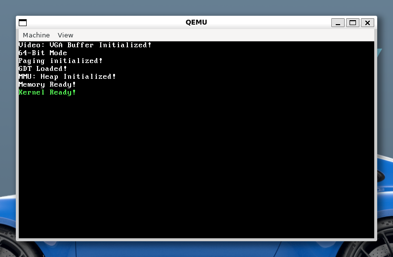

# square-kernel

Um kernel para processadores x86 simples e open-source, desenvolvido por hobby na tentativa de aprender sobre o assunto. 

# Implementações

- Protected-Mode *32 bits*  *(implementado)*

- Vga-Buffer *(implementado)*

- Basic *PM* - Process Manager *(implementado)*

- Basic *MM* - Memory Manager *(implementado)*

- Advanced *PM*

- Hardware Suport (Teclado e etc)

- Basic *FS* - File System *(em progresso)*

## Compilação e Emulação

**Não é recomendado tentar dar boot em uma máquina real, o projeto ainda segue incompleto e não há certeza que a segurança para o hardware é garantida**

### Dependências de Compilação

 - nasm - *compilador assembly x86*
 - gcc - *compilador C*
 - ld - *linker*

### Baixe um emulador

Para rodar o projeto é necessário ter um emulador de x86 instalado, o projeto usa o QEMU

### Baixe o projeto do github:

	git clone https://github.com/https-dre/square-kernel/tree/main
	cd square-kernel

### Crie um diretório para os arquivos de construção

	mkdir build

### Rode o Makefile

Gerando disco virtual com o kernel:

	make build

Rode o kernel junto com o bootloader:

	make run

Para rodar o disco virtual no Vmware:

	make release_vmware

Então um disco virtual .vmdk vai ser gerado, tente dar boot com esse disco no Vmware.

## Licença

Este projeto está licenciado sob a Licença Publica Geral GNU v3.0 - veja o arquivo [LICENSE](LICENSE) para mais detalhes.
